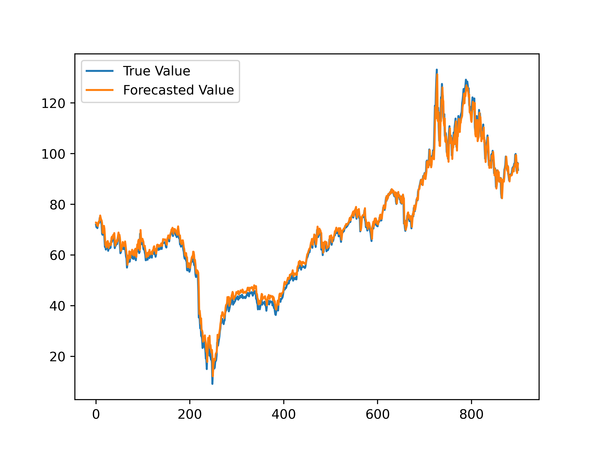
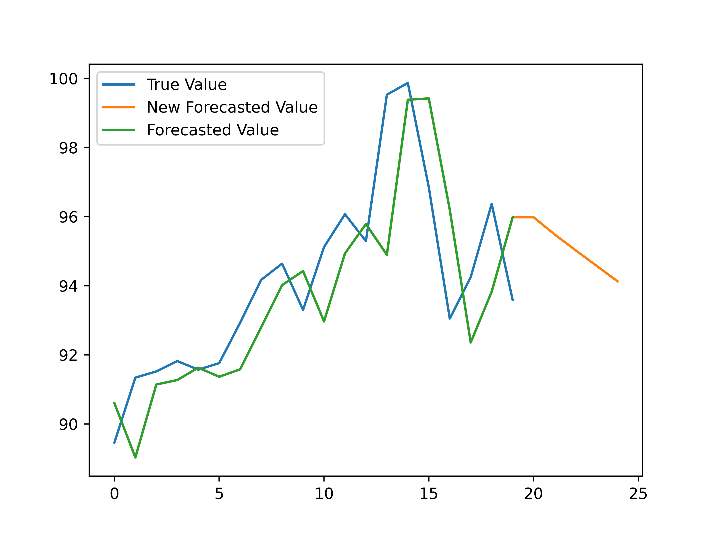

# simple-gru-forecast
Performing simple forecasting using public domain dataset of Brent crude oil prices using the Gated Recurrent Unit (GRU) method.

The results of this case study revealed that the system is quite capable of replicating existing data during the GRU learning process. The following illustrates the replication of training data in the GRU method.

(Persentase Training_ 0.9; Hidden Layer_20; Drop Rate_0.1; Number of Epoch_100, Forecast after denormalization)

Using the trained method, the system will forecast five days into the future based on the testing dataset. The image below shows that the system is quite capable of predicting crude oil prices.

(Persentase Training_ 0.9; Hidden Layer_20; Drop Rate_0.1; Number of Epoch_100, Forecasted value next 5 day)

In this experiment, the system has a Mean Absolute Error (MAE) with a value of 1.79975. To assess the performance of the prediction system, we can use the common rule of thumb forecast, which requires the MAE value and the average value of the dataset, in addition the average value of the dataset is 48.42078. In the common rule of thumb forecast, if the MAE value is less than (<) five percent (5%) of the average value of the data, it can be said that the system has a high accuracy value. Because 1.79975 is less than 5% of 48.42078, then this forecast system is exellent (1.79975 < 2.42104 (or 5% x 48.42078)).
